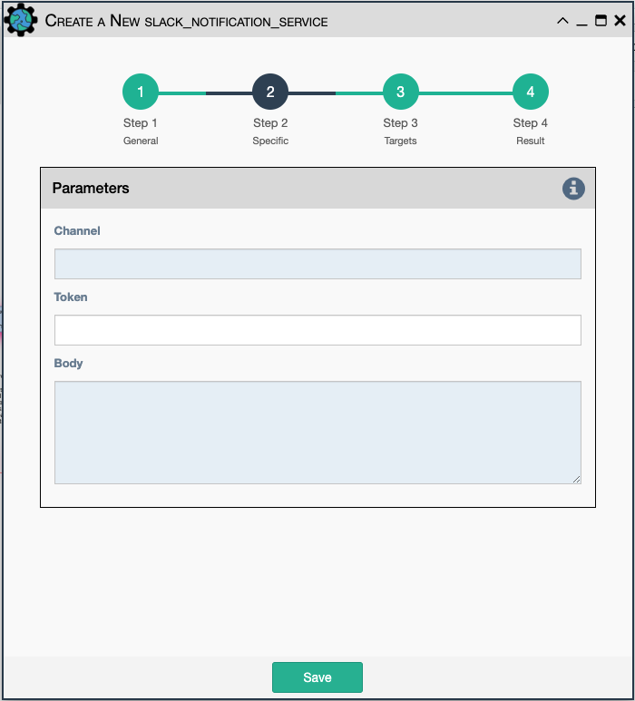

This service will send a message to the slack server that is configured
in the eNMS settings.

- `Channel`- The channel the message will be posted to.
- `Token`- API Token to allow communications to the workspace.
- `Body`- The body of the message that will be posted to the above channel.

!!! note

    This service supports variable substitution in the `Channel` and `Body`
    input fields of its configuration form.
