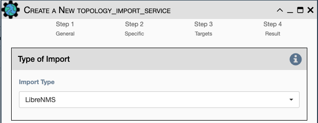
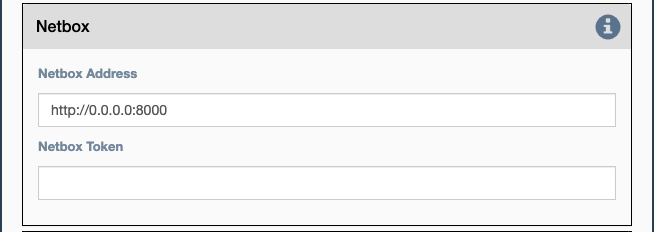
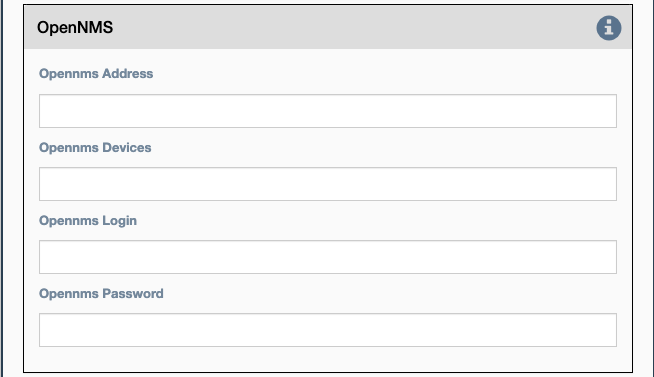
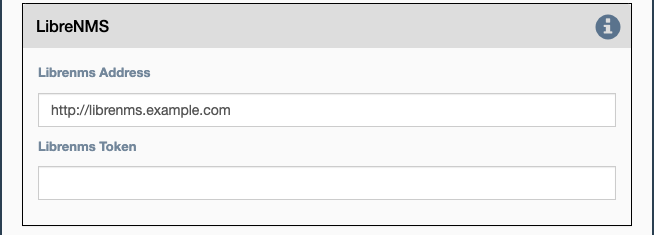

Import the network topology from an instance of LibreNMS, Netbox or OpenNMS.

## Type of Import

- `Import Type` - Choose LibreNMS, Netbox or OpenNMS.

### Netbox

Configuration settings and options for importing topology from a Netbox
Server

- `Netbox Address` - Address for the netbox server.
- `Netbox Token` - API token to allow netbox interactions.

### OpenNMS

Options available for importing a known set of devices from OpenNMS

- `Opennms Address` - Address for the OpenNMS server.
- `Opennms Devices` - A list of devices to query in the OpenNMS server.
- `Opennms Login` - Login for the OpenNMS Server.
- `Opennms Password` - Password for the OpenNMS Server.

### LibreNMS

Configuration settings and options for importing topology from
LibreNMS 

- `Librenms Address` - Address for the LibreNMS Server.
- `Librenms Token` - API token for allowing interaction with LibreNMS.

!!! note

    This service does not depend on the current device.  Always set
    the `Step 3: Targets` page `Run Method` to `Run this service once` 
    to prevent the service from running a duplicate import for each
    target device.
