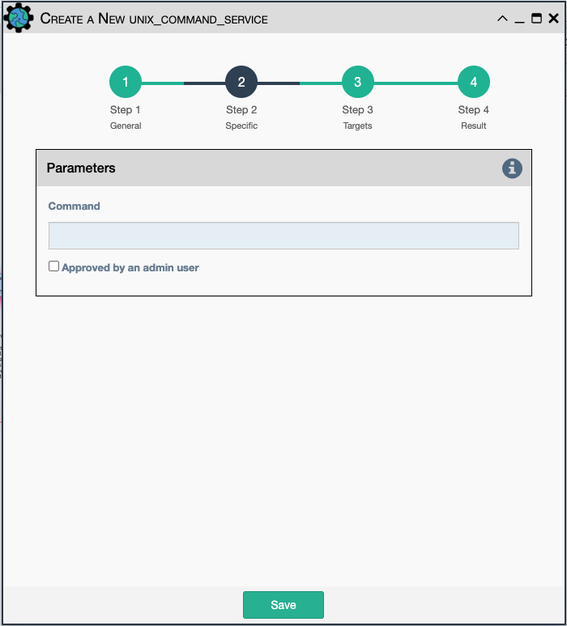

The UNIX Command Service allows for a command to be issued on this eNMS
server instance. This is useful for transferring or setting file
permissions prior to using a file in a workflow.

Configuration parameters for creating this service instance: 

- `Command` - UNIX command to run on the server.
- `Approved by an Admin user` -  That box must be ticked by an admin user for
  the service to be allowed to run. A non-admin user cannot save a service if
  it is ticked, meaning that each time a Unix Command service is edited, it
  must be re-approved.

!!! note

    This service supports variable substitution of input fields 
    of its configuration form.
