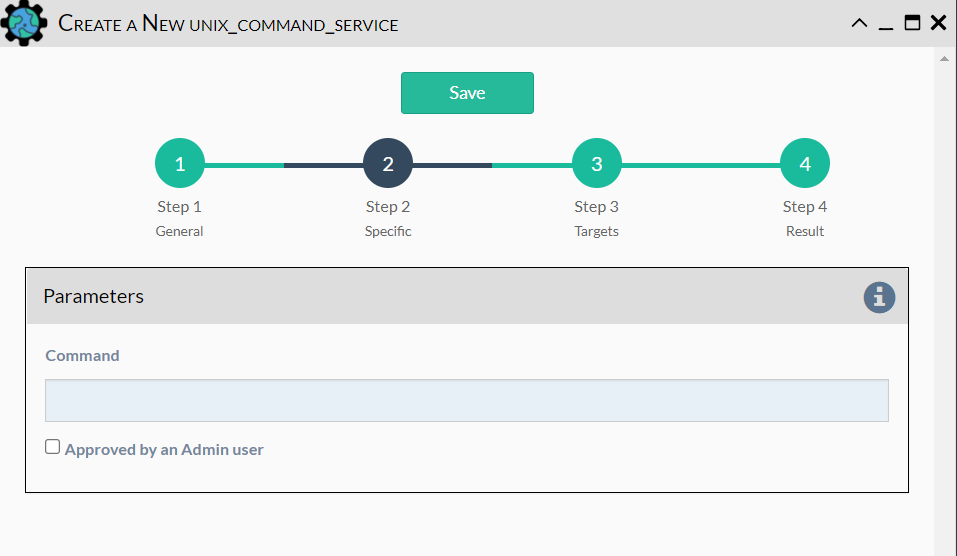

The UNIX Command Service allows for a command to be issued on this eNMS
server instance. This is useful for transferring or setting file
permissions prior to using a file in a workflow.

Configuration parameters for creating this service instance: 

- `Command`: UNIX command to run on the server

!!! note

    This Service supports variable substitution of input fields 
    of its configuration form.
