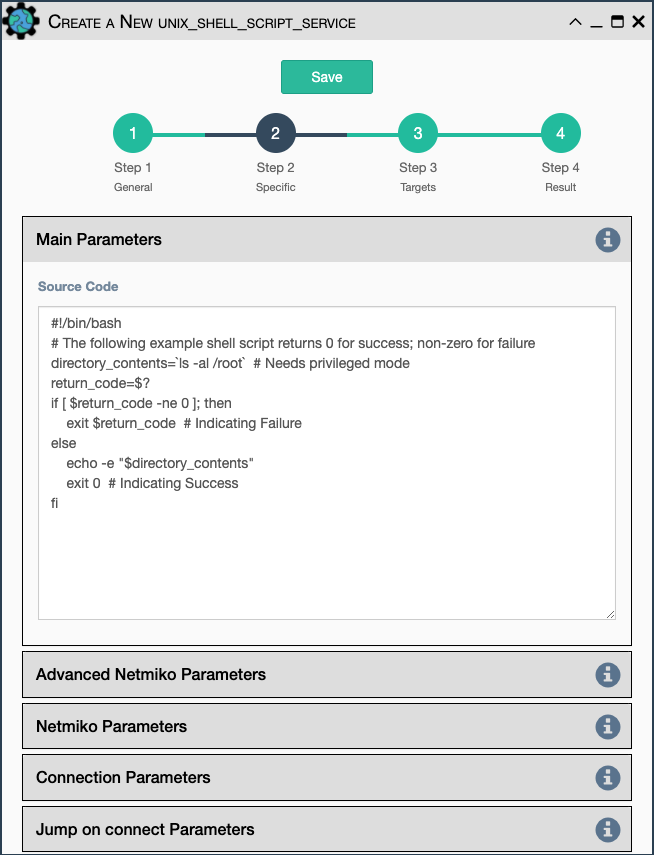

The UNIX Shell Script Service runs a BASH script on a target device. The
user inputs the bash shell script to be transferred to the target device
and executed.

- All [Netmiko Service Common Parameters](netmiko_common.md).
- `Source Code` Bash code to be run on the device.

The service uses Netmiko for connection to the device to run the service,
so it accepts the same Netmiko configuration parameters as the other 
Netmiko services.
