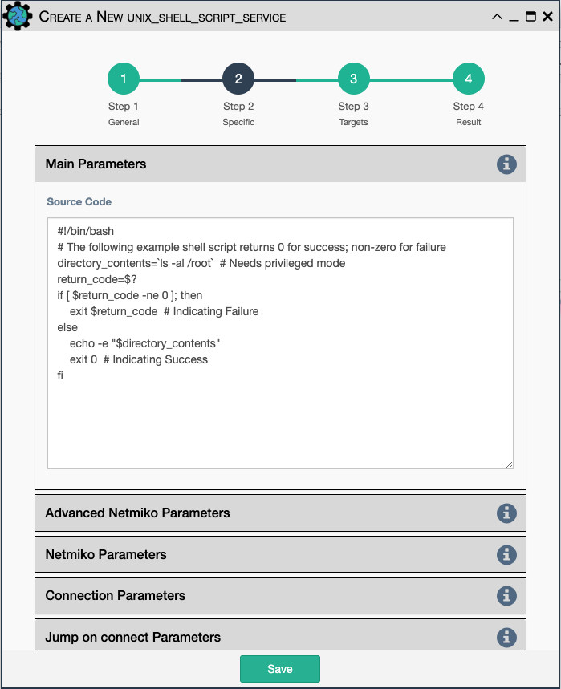

The UNIX Shell Script Service runs a BASH script on a target device. The
user inputs the bash shell script to be transferred to the target device
and executed.

- All [Netmiko Service Common Parameters](netmiko_common.md).
- `Source Code`- Bash code to be run on the device.

The service uses Netmiko for connection to the device to run the service,
so it accepts the same Netmiko configuration parameters as the other 
Netmiko services.

- `Credentials`- Select between:
    - `Device Credentials`- The application will select the most appropriate credential
      object for each device. If there are multiple credentials available, the 
      `Type of Credential` and `Priority` properties become a tiebreaker.
    - `Named Credentials`- Allows users to reference a specific credential for all targets. Selecting this 
      option requires additional selections below.
    - `Custom Credentials`- Allows users to store a credential against this service. Selecting this 
      option requires additional selections below.
      
!!! Advice

    `Named Credentials` selections will persist through duplicating a service, unlike `Custom Credentials`. 
    [For details on creating a `Named Credential` take a look at this page.](../../administration/credentials.md) 

- `Named Credential`- Select from a list of user created credential objects. 
- `Custom Username`- User provided username, stored against this service.
- `Custom Password`- User provided password, stored against this service.

- `Start New Connection`- **Before the service runs**, the current
  cached connection is discarded and a new one is started.
- `Connection Name`- If changed to something other than `default`, the
  connection will be cached as a separate connection to that same device.
  This allows for multiple simultaneous "named" connections to a single
  device.
- `Close Connection`- Once the service is done running, the current
  connection will be closed.