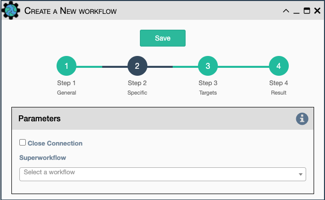

This a placeholder for the ability to add a subworkflow to an existing
workflow as a service.

Configuration parameters include:

`Category`: used for the display of the drop-down list of workflows in the Workflow Builder.
  Each workflow is displayed under its own category. The list of categories can be configured
  in `properties.json` under the key `"property_list" / "workflow" / "category"`.

`Close Connection`: Once the subworkflow is done running, the current
  connection will be closed.
  
`Superworkflow`:  Select from a workflow from the list that will act as a 
  superworkflow.  The superworkflow must have added the `placeholder`
  service to indicate when this workflow will execute.