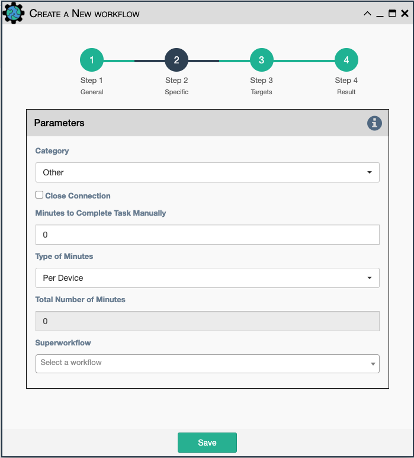

This a placeholder for the ability to add a subworkflow to an existing
workflow as a service.

Configuration parameters include:

- `Category`: used for the display of the drop-down list of workflows in the Workflow Builder.
  Each workflow is displayed under its own category. The list of categories can be configured
  in `properties.json` under the key `"property_list" / "workflow" / "category"`.

- `Close Connection`: Once the subworkflow is done running, the current
  connection will be closed.

- `Minutes to Complete Task Manually`: Manual estimate for how long the process takes to run
  without automation.  The actual time to run with automation will be subtracted from this
  value to determine automation efficiency. This value can be set mandatory in `automation.json`.

- `Type of Minutes`: Whether the time estimate is given `Per Device` or `For the whole Workflow`

- `Total Number of Minutes`: The sum of all times this workflow has run on this instance of eNMS.
  This value is read-only and for display purposes only.
  
- `Superworkflow`: Select from a workflow from the list that will act as a 
  superworkflow.  The superworkflow must have added the `placeholder`
  service to indicate when this workflow will execute.
