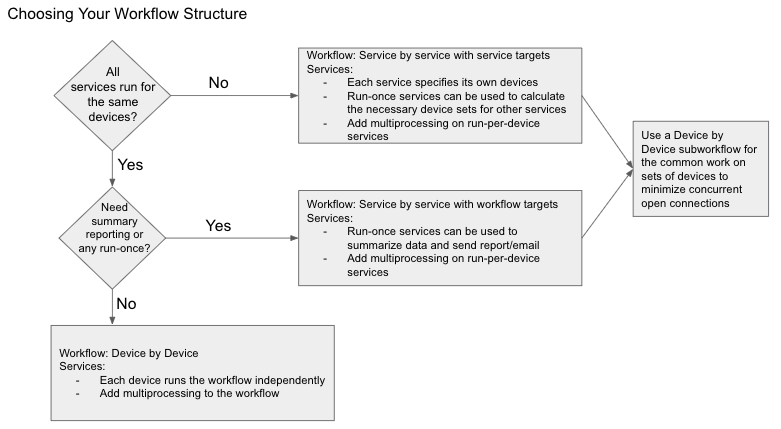

## Workflow Traversal

The method by which devices traverse through the workflow execution depend
on the workflow `Run Method` configurable in the Step3 `Targets` section of
the edit panel. There are three run methods for a workflow:

### Device by device

- Uses the devices configured at **workflow** level.
- Multiprocessing, if desired, is only effective at **workflow** level.
- Workflow will run for each device independently: one at a time if
  multiprocessing is disabled, or in parallel otherwise.

| What                              | Its behavior in this mode                          |
| ---------------                   | -----------------------------                      |  
| Services                          | Each device flows through the workflow independently.  Service targets are ignored. |
| Devices                           | Each service is executed for a single device at a time; therefore, the service run method is irrelevant.|
| Multiprocessing                   | Allows multiple instances of the workflow to run concurrently, each for a single device. |  

### Service by service using workflow targets

- Uses the devices configured at **workflow** level.
- Multiprocessing, if desired, is only effective at **service** level.
- The workflow will run one service at a time, but each device can
  follow a different path depending on the results of each service
  for that device.
  
| What                              | Its behavior in this mode                          |
| ---------------                   | -----------------------------                      |  
| Services                          | Each service runs for all devices before moving to the next service. |
| A Service set to `Run Per Device` | Service executes for each workflow device that flowed to it.  |
| A Service set to `Run Once`       | Service executes one time.  `devices` contains the full list of devices.  The variable `device` is not defined. |
| Devices                           | Workflow targets are used.  Service targets are ignored. |
| Multiprocessing                   | Allows multiple workflow devices to be run concurrently. |  

### Service by service using service targets

- Uses the devices configured at **service** level.
- Multiprocessing, if desired, is only effective at **service** level.
- The workflow will run one service at a time. A service is
  considered successful if it ran successfully on all of its targets
  (if it fails on at least one target, it is considered to have
  failed).

| What                              | Its behavior in this mode                          |
| ---------------                   | -----------------------------                      |  
| Services                          | Each service runs for all devices before moving to the next service. |
| A Service set to `Run Per Device` | Service runs for each service device that is selected as a target.  |
| A Service set to `Run Once`       | Service executes one time. `devices` contains the full list of service devices.  The variable `device` is not defined. |
| Devices                           | Service targets are used.  Workflow targets are ignored. |
| Multiprocessing                   | Setting on workflow has no effect with service targets.  Depends on the multiprocessing setting on the service. |

### Decision matrix for Designing a Workflow

  