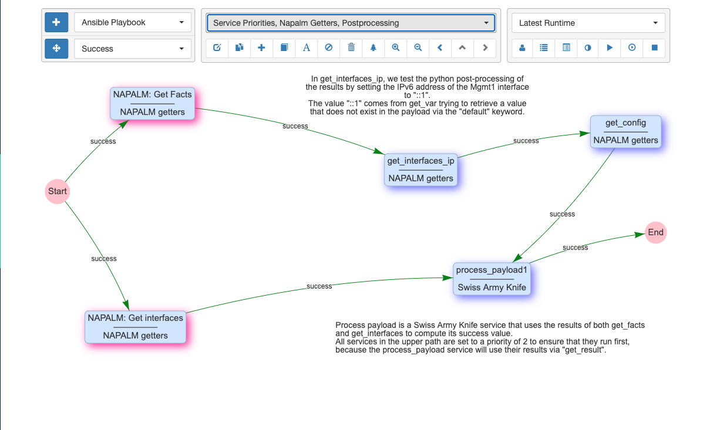
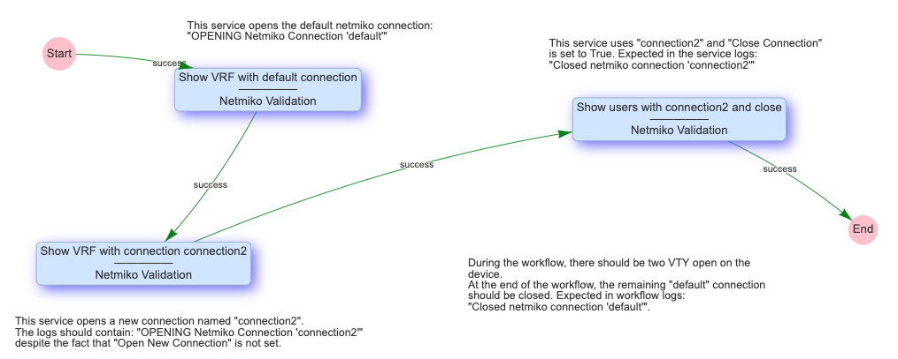

# Workflow System

A workflow is a graph of services connected with `success` and `failure`
edges. If a service is executed successfully, the workflow continues
down the `success` path to the next service, otherwise it goes down the
`failure` path. A workflow is considered to have run successfully if the
`"End"` service is reached. For this reason, a `failure` edge should be
used for:

- Recovery from a failure, using some corrective action, that allows
  the workflow to then continue on the `success` path
- Cleanup or finalization of the state of a device, following the
  failure, before the workflow ends

Workflows are managed from `Automation/Workflow Builder`, and they are listed
in the `Automation/Services` table. When a workflow is running, the results
are automatically updated in real-time in the workflow builder, and its
status is listed in real-time in the `Automation/Results` table.

## Workflow Builder

The Workflow Builder's panel is organized into 3 blocks of controls:

- Section 1: Services and Edges Creation controls:

    - The first row lets the user choose a service type and click on the
      `"+"` button to create a new service that will be added to the workflow.
    - On the second row, the button toggles the mode between `"Edge
      Creation"` and `"Motion"` which allows the services to be repositioned.

- Section 2: Edit and View Workflow controls:

    - `Pull-down`: Choose which Top Level Workflow to display
    - `Edit` current workflow
    - `Duplicate` current workflow into a new workflow
    - `Create` (a new) top level workflow
    - `Add existing services` to the current workflow, which supports:
    
        - Deep Copy: creates a new copy of an existing service in this workflow
        - Shallow Copy: references an existing service in the current workflow
          (Note: changing a referenced or shared service causes the change to
          impact all workflows that use that service.)
   
    - `Create a text label`
    - `Skip (or Unskip)` selected service(s) such that they do not run during
      execution
    - `Delete` selected service(s) or edges(s)
    - `Workflow tree`: display all services of the workflow in a tree structure
    - `Zoom In`: makes the display aspect ratio larger (also achievable via the
       mouse wheel)
    - `Zoom Out`: makes the display aspect ratio smaller (also achievable via
       the mouse wheel)
    - `Previous workflow`: functions like the Back-button of the browser
    - `Switch to Parent workflow`: transitions back to the parent workflow if
      a subworkflow has been double-clicked for drill down
    - `Next workflow`: functions like the Next-button of the browser

-   Section 3: Run or Stop the workflow, Browse Logs and Results

    - `Pull-down`: Select which runtime to display. `Normal Display` is without
      results. `Latest Runtime` shows the latest set of results and refreshes
      when new results become available. Selecting a specific runtime result
      will prevent refreshing for any new runtimes and will continue to
      display that historical run.
    - `Personal or All Runtimes`: toggle between listing all runtimes for this
      workflow or only runtimes from the current user. This also controls
      which runtime is displayed when `Latest Runtime` is selected.
    - `View Logs` for the selected runtime
    - `Results Tree`: show a tree of per-service results with buttons to view
      that service's logs or the per-device results table.
    - `Result Comparison`: visually compare results across runtimes, within the
      same runtime, across the same or different services, and between the
      same device or different devices.
    - `Run the Workflow`: using its saved parameters and the saved parameters
      of its contained services
    - `Parameterized Run`:  run the Workflow by first popping up a user input
      panel to prompt for select parameters (so that those parameters, such
      as which device targets to run on, do not need to be saved inside the
      workflow).  The list of parameters to prompt for are set in Step1 of
      the workflow editor.
    - `Stop the Workflow`:  the workflow will stop once the devices-in-progress
      finish their current service. This feature is also available from a button
      in the `Automation -> Services` table along side each result status.

!!! note

    Some of these actions are also available from right-click mouse menus.
    Clicking on the background, on a service or on an edge generate
    different menus.
    

## Workflow Traversal

The method by which devices traverse through the workflow execution depend
on the workflow `Run Method` configurable in the Step3 `Targets` section of
the edit panel. There are three run methods for a workflow:

### Device by device

- Uses the devices configured at **workflow** level.
- Multiprocessing, if desired, is only effective at **workflow** level.
- Workflow will run for each device independently: one at a time if
  multiprocessing is disabled, or in parallel otherwise.

| What                              | Its behavior in this mode                          |
| ---------------                   | -----------------------------                      |  
| Services                          | Each device flows through the workflow independently.  Service targets are ignored. |
| Devices                           | Each service is executed for a single device at a time; therefore, the service run method is irrelevant.|
| Multiprocessing                   | Allows multiple instances of the workflow to run concurrently, each for a single device. |  

### Service by service using workflow targets

- Uses the devices configured at **workflow** level.
- Multiprocessing, if desired, is only effective at **service** level.
- The workflow will run one service at a time, but each device can
  follow a different path depending on the results of each service
  for that device.
  
| What                              | Its behavior in this mode                          |
| ---------------                   | -----------------------------                      |  
| Services                          | Each service runs for all devices before moving to the next service. |
| A Service set to `Run Per Device` | Service executes for each workflow device that flowed to it.  |
| A Service set to `Run Once`       | Service executes one time.  `devices` contains the full list of devices.  The variable device is not defined. |
| Devices                           | Workflow targets are used.  Service targets are ignored. |
| Multiprocessing                   | Allows multiple workflow devices to be run concurrently. |  

### Service by service using service targets

- Uses the devices configured at **service** level.
- Multiprocessing, if desired, is only effective at **service** level.
- The workflow will run one service at a time. A service is
  considered successful if it ran successfully on all of its targets
  (if it fails on at least one target, it is considered to have
  failed).

| What                              | Its behavior in this mode                          |
| ---------------                   | -----------------------------                      |  
| Services                          | Each service runs for all devices before moving to the next service. |
| A Service set to `Run Per Device` | Service runs for each service device that is selected as a target.  |
| A Service set to `Run Once`       | Service executes one time. `devices` contains the full list of service devices.  The variable device is not defined. |
| Devices                           | Service targets are used.  Workflow targets are ignored. |
| Multiprocessing                   | Has no effect with service targets.  Depends on the multiprocessing setting on the service. |

### Decision matrix for Designing a Workflow

  

## Transfer of Data between Services

### Retrieving Links and neighboring Devices: `get_neighbors()`

The user can retrieve the list of links to and from the target device
as well as the neighboring devices at the ends of those links with the
`device.get_neighbors()` function. The function requires a mandatory
parameter `device` or `link` and optional parameters for the 
`direction=source` or `direction=destionation` as well as any of the parameters
of the Link object.

Examples:

- `device.get_neighbors("device")`
- `device.get_neighbors("link")`
- `device.get_neighbors("device", direction="source"))`
- `device.get_neighbors("link", direction="source"))`
- `device.get_neighbors("device", direction="destination"))`
- `device.get_neighbors("link", direction="destination"))`
- `device.get_neighbors("device", model="10G"))`
- `device.get_neighbors("link", model="400G"))`
- `device.get_neighbors("device", direction="source", model="40G"))`
- `device.get_neighbors("link", direction="destination", model="10G"))`

The `device.get_neighbors()` function works everywhere that the target device
is defined and is dependent on the run method selected (see `Run Method` above
and in the Services section.

### Using the Result of a Previous Service: `get_result()`

During a service's execution, the user can have access to the results of
all services in the workflow that have already been executed with a special
function called `get_result()`. The result of a service is the
dictionary that is returned by the `job()` function of the service, and
calling `get_result()` will return that dictionary. There are two types of
results: top-level and per-device. If a service runs on 5 devices, 6
results will be created: one for each device and one top-level result
for the service itself. The top-level results contains the parameters that
the service used during execution.

Examples:

- `get_result("get_facts")` Get the top-level result for the service
  `get_facts`
- `get_result("get_interfaces", device="Austin")` Get the result of
  the device `Austin` for the `get_interfaces` service.
- `get_result("get_interfaces", device=device.name)` Get the result of
  the current device for the `get_interfaces` service.
- `get_result("Payload editor")["runtime"]` Get the `runtime` key of
  the top-level result of the `Payload editor` service.

The `get_result()` function works everywhere that python code is accepted.

### Saving and Retrieving Values in a Workflow: `get_var(),set_var()`

The user can define variables in the payload with the `set_var()` function,
and retrieve those variables\' data from the payload with the `get_var()`
function using the first positional argument (the variable name) and the
same optional arguments defined in `set_var`. If neither of the optional
arguments are used the variable will be global.

- The first argument for set_var is positional and names the variable
  being set.
- The second argument for set_var is positional and assigns the value
  for the variable.
- An optional argument for set_var uses keyword \"device\", which can
  scope the variable to the device the service is using when the
  variable is set.
- An optional argument for set_var uses keyword \"section\", which can
  scope the variable to a user provided custom scope.

Examples:

    set_var("global_variable", value=1050)
    get_var("global_variable")
    set_var("variable", "variable_in_variables", section="variables")
    get_var("variable", section="variables")
    set_var("variable1", 999, device=device.name)
    get_var("variable1", device=device.name)
    set_var("variable2", "1000", device=device.name, section="variables")
    get_var("variable2", device=device.name, section="variables")
    set_var("iteration_simple", "192.168.105.5", section="pools")
    get_var("iteration_simple", section="pools")
    set_var("iteration_device", devices, section="pools", device=device.name)
    get_var("iteration_device", section="pools", device=device.name)

### Retrieve a Credential from the Vault: `get_credential()`

A user with `Admin` level access can call the `get_credential()` function
within a service to retrieve a credential object from the Vault. It returns
a dictionary with clear-text username and password. 

Example:
    get_credential(name="credential_name")
    
A use case would be to use "Unix Command" service to invoke a command that
requires the credential.  Logging should be deactivated for such a service
as the clear-text credentials would otherwise appear in the logs. A "Python
Snippet" service could accomplish the same task by using subprocess to run
the command on the server.

!!! note

    Make sure not to store the output of `get_credential()` in the result or in
    the payload (using one of the previously mentioned functions); otherwise,
    those values will be stored in the database.  They can be stored in the 
    payload temporarily as long as it is removed at the end of the workflow.

## Other Concepts:

### Service Dependency

If a workflow contains parallel paths of execution, and one service must be
run after another service in another path, you can enforce that order
by configuring Priority in Step1 of the Service/Workflow Editor. One such
example is illustrated here:

 
Priority allows the user to determine the order a service runs when two
services would otherwise be run at the same time. The typical use case is
when a service has two edges exiting from the right side and both edges are
the same type. In this case the user may determine the order of the service
execution using Priority. The higher number gets run first.

### Restart Workflow From Here

Using the right-mouse-click menu, a workflow can be restarted from any
service as the \"Entry point\" and using the runtime payload from a
previous run. This is useful if:

- the user is testing a workflow with a lot of services
- device targets fail unreliably and automation must be restarted at 
  unpredictable locations in the workflow and:
  
  a) services are not idempotent, meaning that it is not possible to
     re-run the same services on the devices without breaking, or:

  b) there is simply not enough time to re-run all the previous
     services.
  
Selecting `Restart Workflow from Here` by right clicking on a service 
presents the user with a form to select:

- `Restart Runtime`: The previous runtime to use as the payload for
  continuing the workflow. This defaults to the runtime that is currently
  displayed in the workflow builder.
- `Targets` gives several options for where to obtain device targets for
  the new run:
   
      - Manually defined:  Use the targets manually defined below
      - Restart run: Use the targets from the selected restart runtime
      - Workflow:  Use the targets that are currently defined at workflow level
        
- `Devices`: for use with the `Manually defined` option above
- `Pools`: for use with the `Manually defined` option above

!!! note

    Variables set to values, that cannot be streamed as JSON, will not be
    available to subsequent services after restarting the workflow. For
    example, if the user performed a set_var on a python function to allow
    it to be used in a subsequent service, this will not work after using
    `Restart Workflow from Here`.

### Connection Cache

When using netconf, netmiko, napalm, and scrapli services in a workflow,
eNMS will cache and reuse the connection automatically. In the Step2
`Connection Parameters` section of a service, there are some properties to
change this behavior :

- `Start New Connection`: **before the service runs**, the current
  cached connection is discarded and a new one is started.
    
- `Connection Name`: If changed to something other than `default`, the
  connection will be cached as a separate connection to that same device.
  This allows for multiple simultaneous \"named\" connections to a single
  device, as in this example:
  
  
    
- `Close Connection`: once the service is done running, the current
  connection will be closed.

### Waiting Times and Retries

Services and Workflows have a `Time to Wait` property: this tells eNMS
how much time it should wait after the service has run before it begins
the next service.

A service can also be configured to `Retry` in the event of a failure. 
Retries allow for a `Number of Retries`, `Time between retries`, `Max
number of retries` to be configured. 

The `Max number of retries` exists because it is possible for the user to
manipulate the `retries` variable in `post processing` section for service
results.  For example, the user could set additional retries in the event
of some condition, or perhaps if something is missing in the results, increase
retries by `1`.  This `Max number of retries` is settable to prevent an
infinite loop from occurring: once it is reached, the service will fail.

To demonstrate the relationship between retries and wait times, an example
execution of a service in a workflow is as follows:

    First try (failure)
    time between retries pause
    Retry 1 (failure)
    time between retries pause
    Retry 2  (Successful, or only 2 Retries specified)
    Waiting time pause

### Superworkflow

Just as a workflow can contain a subworkflow to subdivide and
encapsulate related functionality, a workflow can also designate a
superworkflow in `Step2`. The superworkflow allows for services to
be run before and after the main workflow and using a potentially
different workflow traversal mode (service by service or device by
device). 

Superworkflow functions like a document template so that
activities common to all workflows can be performed. When the same
superworkflow is used by multiple main workflows, it behaves like a
shared service: a change to the superworkflow affects all workflows that
use it. 

In the superworkflow definition in Workflow Builder, the
position of the main workflow is designated by adding the `Placeholder`
service to the graph. And in the main workflow definition, the
superworkflow must be selected from the list of existing workflows.
