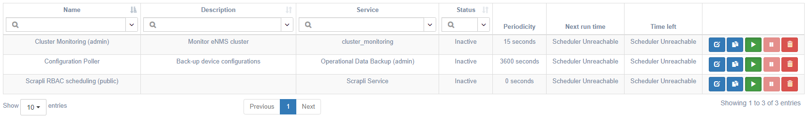

# Features

## Creation of the network

Network topology can be created manually or imported from an external 
Source of Truth (OpenNMS, LibreNMS, or Netbox). Once created, it is displayed in
a sortable and searchable table. A dashboard provides a graphical overview of 
the network with dynamic charts: clicking on a portion of a graph opens an
inventory table panel to that group of data.

Once device and circuit network data have been created, related data can be
grouped into pools.

## Network Visualization

eNMS can display network data on a world map (Google Map or Open Street Map). 
Each device is displayed at its GPS coordinates. Click on a device to display 
its properties, configuration, or start an SSH terminal session.

Network topology diagrams can be created in the Network Builder view, using
devices and links from inventory, and adding labels for clarity.

## Services and Workflows

Services are a set of adaptable, extensible, and reusable components that
encapsulate a single unit of work or device interaction. Workflows are made up
of one or more services (or sub-workflows) that represent a series of distinct
steps to accomplish a complex task. They are a visual representation of a
network automation activity. When a workflow is executed, its status is updated
in real-time on the web UI; each service will be continually updated with
current status information. 

## Device and Link Management  

Devices provide one or more interfaces to allow remote management from eNMS. 
Services and workflows orchestrate the device interactions, and links control 
the traversal of interactions through the automation.

Additionally, eNMS provides a Web-based SSH session feature to facilitate manual device 
interactions and includes security and logging features.

## Configuration Management

eNMS can be used as a network device configuration backup tool and replace 
platforms such as Oxidized/Rancid.  It supports the following features:

-   Communication over standard protocols like SSH, REST, or NETCONF.
-   Poll network elements and store the latest configuration in the database.
-   Search for any text or regular-expression in all configurations.
-   Download device configuration to a local text file.
-   Use the REST API support to return a specified device's configuration.
-   Export all configurations to a remote Git repository (e.g. Gitlab).
-   View git-style differences between various revisions of a configuration.

## Event-driven automation

While services can be run directly and immediately from the display, they can 
also be scheduled to run at a later time, or periodically by defining a
frequency or a CRON expression. Active scheduled tasks are displayed in the
Task Calendar. All tasks are displayed in the Scheduling Tasks table,
regardless of active status.

*Task Calendar*

*Scheduling Task Table* 

Services can also be executed programmatically. eNMS has a REST API and a CLI 
interface that can be used to create, update and delete managed objects, 
but also to trigger the execution of a service.

## Security features 

Security features include activity logging, role-based access control, credentials 
management, and WebSSH session logging.