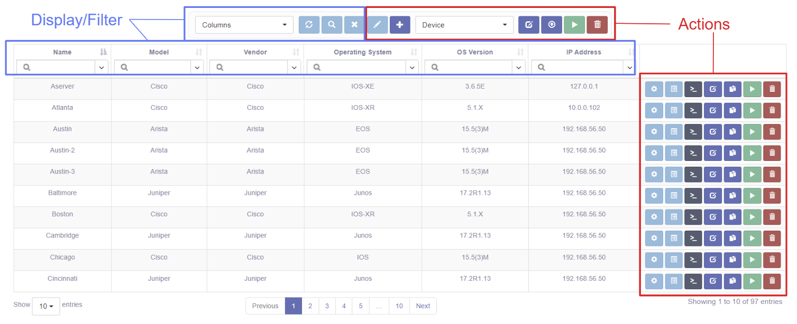
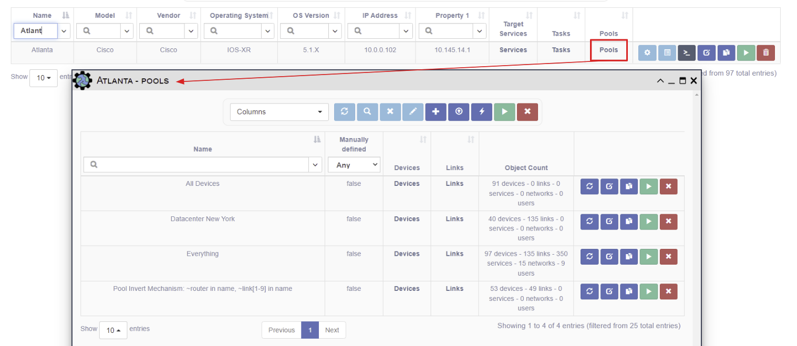

# Devices

## Overview 

A Device represents a piece of network equipment that is managed by eNMS.

The table has selectable columns for browsing the Device properties like Name, Model, 
Vendor, Operating System, OS Version, IP address, and Geographical Location (assigned 
Latitude and Longitude).  

The specific values available in the Vendor and Operating System pull-downs are 
configurable in `properties.json`.

## Displaying and Filtering Devices

Use the Columns pull-down to select which table columns to display.
Refer to the [Search System](../../advanced/search_system/) for instructions on 
how to filter this table.
 
## Device Management

These actions apply to all devices selected by the current Device filter: 

- *Copy Selection to Clipboard* - copies the device names - useful for updating manually
   defined pools.
- *Bulk Edit* - change Device properties for more than one device.
- *Export as CSV* - download a CSV file with the table data.   
- *Run Service on all devices in table* - another way to specify targets when running a service/workflow.
- *Bulk Deletion* - delete all the selected data.

These actions apply to a single device: 

- *New* - create a new Device or Device subclass (Gateway, Router).
- *Network Data* - quick view of Configuration data; see also: [Configurations](../configuration_management/).
- *Results* - view result data for this device.
- *Connect* - open a [WebSSH Connection](../web_connection/) to a device.
- *Edit* - edit this device.
- *Duplicate* - create a copy of this device. 
- *Run Service* - run a service targeting this device. 
- *Delete* - delete this device.

## Managing Device Access
User maintained `Access Control` is available for this object. This allows the `Owners` to select desired access.
[Check out this page for more details on modifying `Access Control`.](../administration/overview.md)  

## Showing Pools, Tasks, or Services for a Device 

One can also view relationships for devices - i.e., the Pools, Services, and Tasks 
associated with a device.  For example, to view the Pools for a device:

- select Pools in the Columns pull-down, and  
- click on the Pools link

