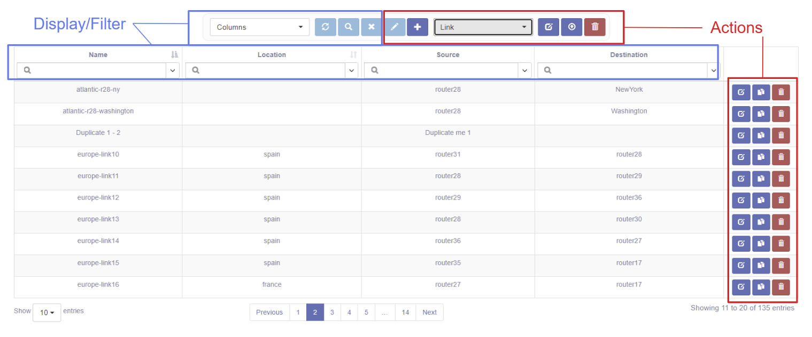
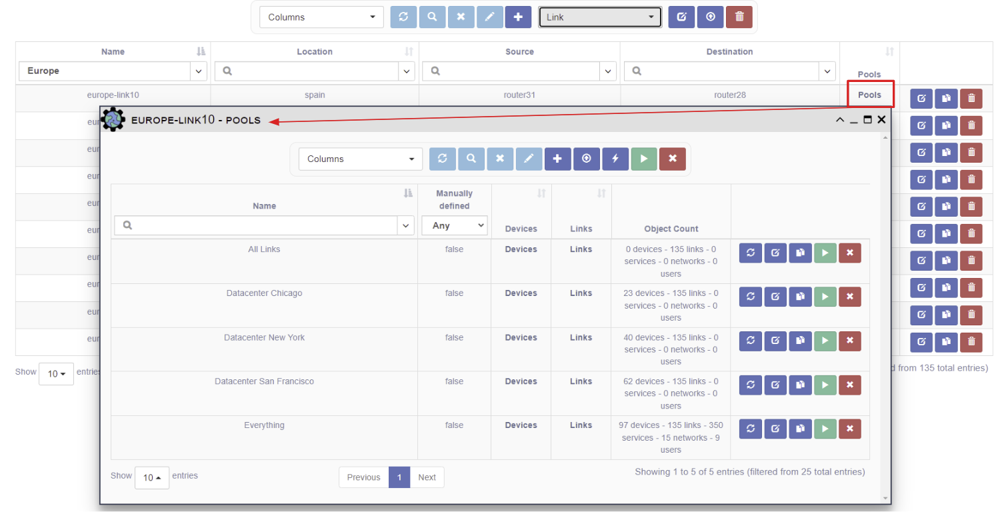

# Links

## Overview 

A Link represents a logical or physical connection between two Devices (source, 
destination).

The table has selectable columns for browsing the Link properties like Name, Model, 
Vendor, Source, and Destination.

## Displaying and Filtering Links

Use the Columns pull-down to select which table columns to display.
Refer to the [Search System](../../advanced/search_system/) for instructions on 
how to filter this table.

## Link Management

These actions apply to all links selected by the current Link filter: 

- *Copy Selection to Clipboard* - copies the link names. 
- *Bulk Edit* - change Link properties for more than one link. 
- *Export as CSV* - download a CSV file with the table data.   
- *Bulk Deletion* - delete all the selected data.

These actions apply to single link: 

- *New* - create a new Link or Link subclass (Ethernet Link). 
- *Edit* - edit this specific link. 
- *Duplicate* - create a copy of this link.
- *Delete* - delete this link.

## Managing Link Access
User maintained `Access Control` is available for this object. This allows the `Owners` to select desired access.
[Check out this page for more details on modifying `Access Control`.](../administration/overview.md)  

## Showing Pools for a Link

One can also view relationships for Link - i.e., the Pools, associated with a link.  
For example, to view the Pools for a link:

- select Pools the in the Columns pull-down, and,  
- click on the Pools link.

