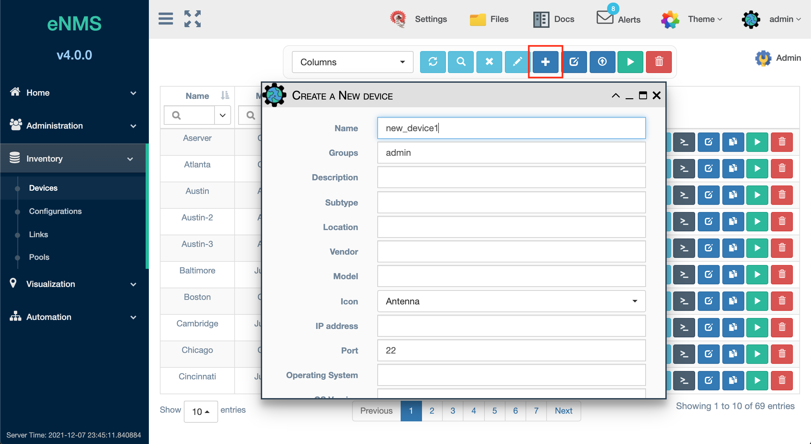
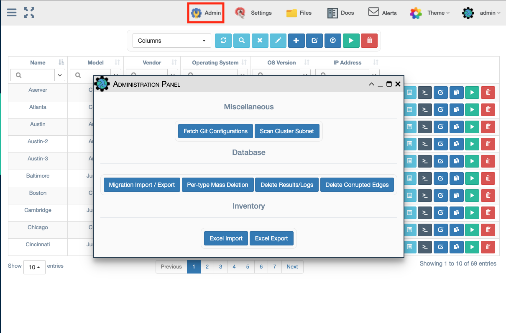
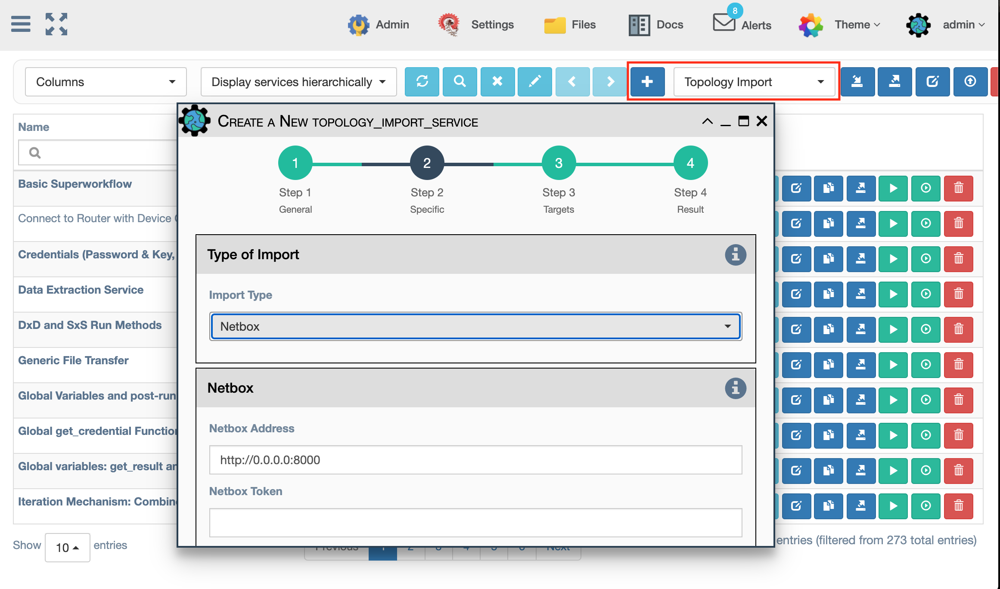

# Network Creation

The network topology within the tool originates from the Device and Link
inventory that gets loaded. There are several ways below to add this
information into eNMS. Having accurate device and link inventory data
available to the various processing features of eNMS is critically
important to device security and automation accuracy.

## From the UI Manually (One at a Time)

The user can manually create each Device and Link in the inventory by
filling a form in `Inventory / Devices` and `Inventory / Links` using the
 `+` button in the top menu.

!!! note 
    Some properties are mandatory:

    - Name: objects are uniquely defined by their name.
    - Source and destination: a link needs a source and a destination to
      be created.
    - In order to visualize the network topology on a map, devices must have
      geographical coordinates (longitude and latitude).

## From an Excel Spreadsheet

The inventory can be imported-from and exported-to an Excel spreadsheet in
the `Inventory` section of the Administration (Admin) panel. The user can
find examples of such spreadsheets in `files/spreadsheets`. It is important
that the proper column heading names match the examples in order to import
properly.

!!! note

    If you import an object that has already been created, its properties
    will be updated.

## Querying an external API

Another way to create the network topology is to query an external API. The
following are supported:
- OpenNMS
- Netbox
- LibreNMS

This is accomplished by creating and running a `Topology Import` service from
the `Automation -> Services` page. Step 2 of the service allows you to select
which `Import Type` the user wishes to connect with and filling the
corresponding section of the form.

## Externally driving the Tool's own REST API

The inventory can be created by using an external script or program to call the
tool's own REST API to add Devices and Links to the inventory. This is 
particularly useful if another system is used to maintain the network source
of truth.  It can audit and add/delete Devices and Links on demand from the
tool's inventory. See the documentation section on the REST API for more 
information.