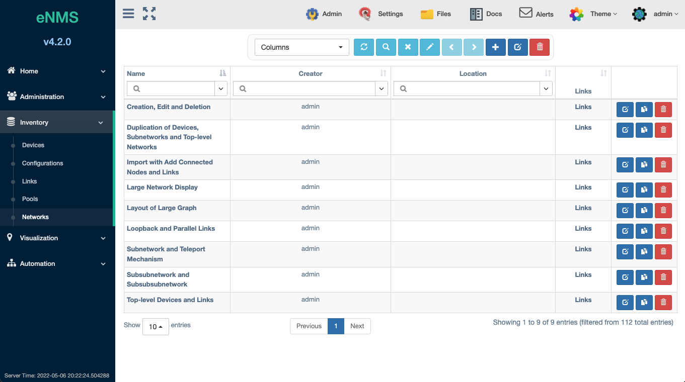

# Networks

A Network is an association of devices and links that form a topology diagram.
Each diagram helps with the visualization of devices and its associated links
that connect it to other devices. The Networks Panel allows the user to browse
and filter the created Networks.

The table has selectable columns for browsing the Network Name, Description,
Creator, Geographical Location (assigned Latitude and Longitude), and included
Links.  

Each Network has buttons for editing, duplicating, and deleting a Network.

## Managing Service Access
User maintained `Access Control` is available for this object. This allows the `Owners` to select desired access.
[Check out this page for more details on modifying `Access Control`.](../administration/overview.md)  