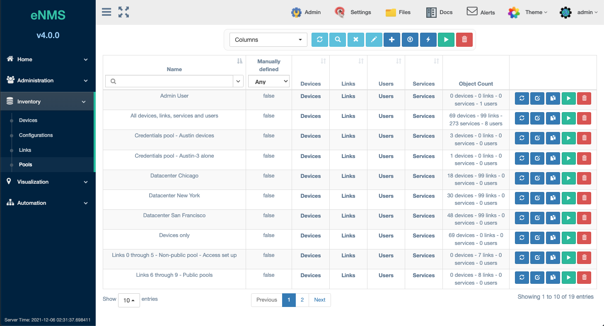
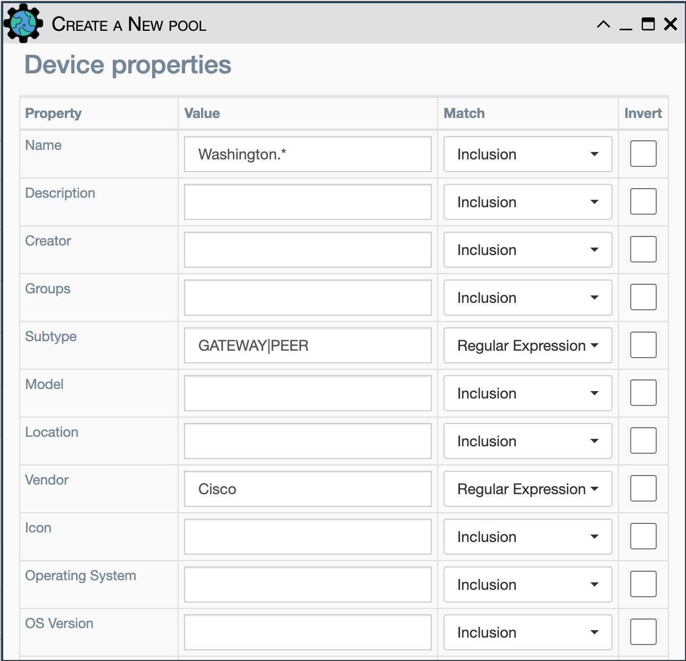
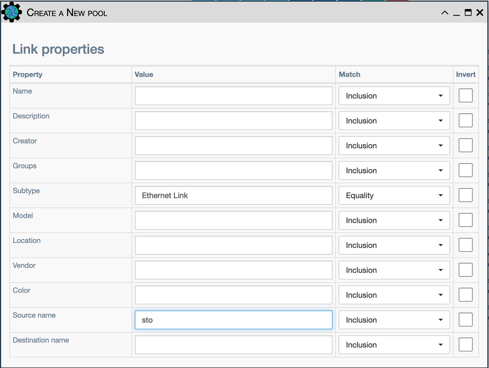
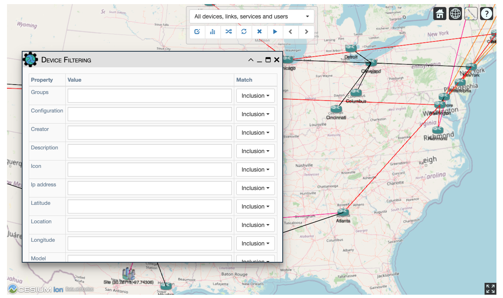
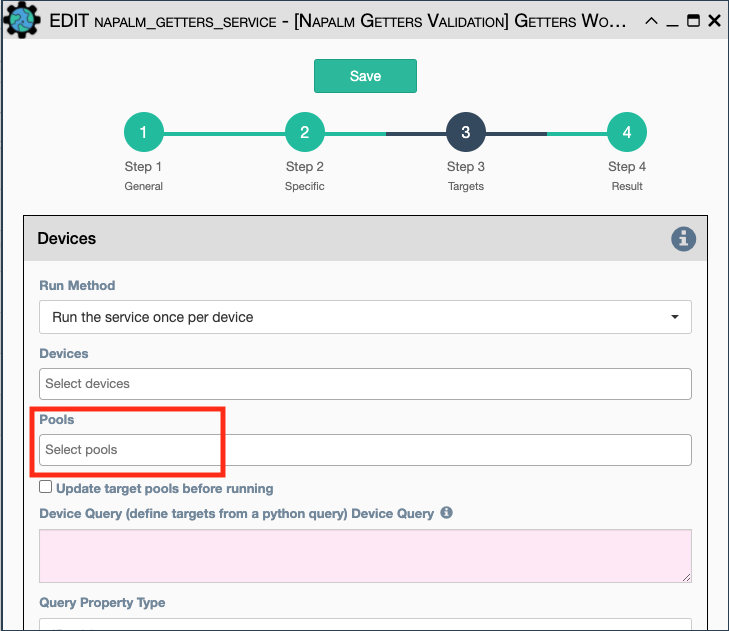
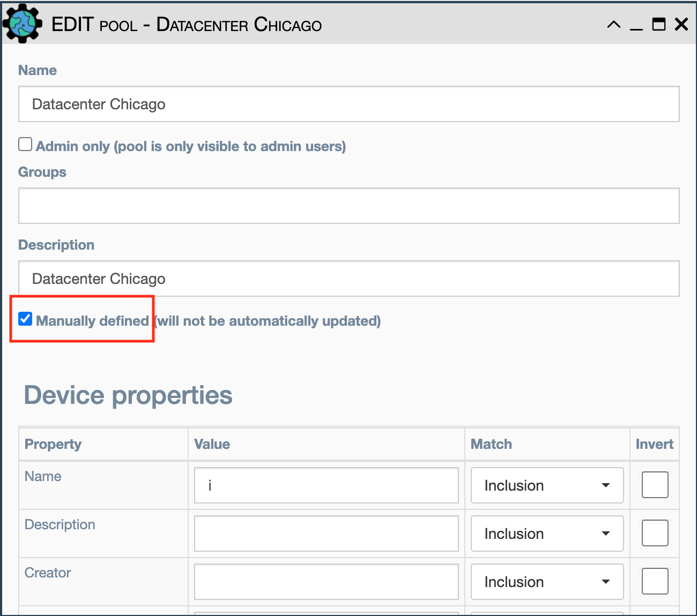
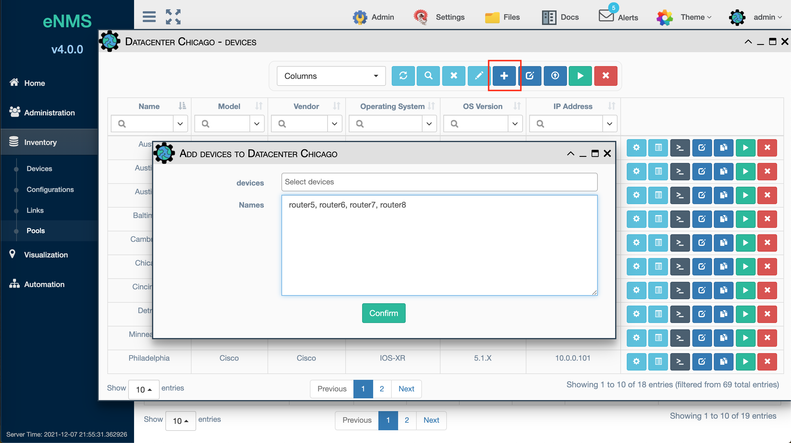
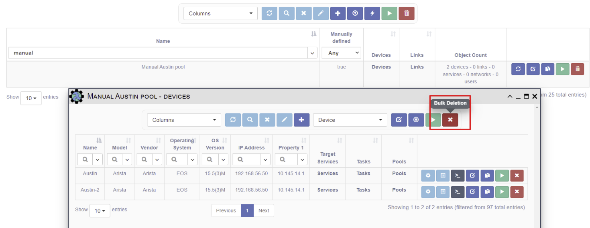

# Pools

## Overview 

A Pool is a collection of objects of the following types:

- Devices.
- Links.
- Users.
- Services.
- Networks.

Pools can contain a single type of object or a mix of objects types.  For each
object type, a set of selection properties is used to determine which objects
of that type will be included in the pool. If the properties of an object
matches the pool properties, that object is automatically included in
the pool. Alternatively, pools can be edited to manually select objects instead
of using criteria based on properties.

The context where a pool is used determines which object types are used from
the pool. For example, when a pool specifies the targets for a workflow, the
devices are used and links, users, and services in the pool are ignored.

Pools are used in several parts of the application:

- Targets of a Service or Workflow:  Devices can be added to a
pool, which is then selected as the execution target for a Service or Workflow
automation to run on.

    - Pools can also be specified as the execution targets of a Scheduled Task.
    If a pool is also specified as the target within the service or workflow,
    the Scheduled Task's pool overrides which devices the
    automation executes against.
    
- Visualization Scope:
    - Geographical Visualization: pool selection is used to filter which objects 
    are presented on the map. The pool list only shows pools with devices
    and links. Pools of only Users and Services are omitted since these don't
    make sense to show on a map.
    - Network Builder: displays existing Network objects (from 
    `Inventory -> Networks`) on the graph.  The `Add to Network` button allows
    pools of devices and links (as well as individual devices and links) to be
    added to the currently displayed Network. 

- Advanced Search / Relationship Based Filtering:  Pools can be targets for the 
union, intersection, or empty match in order to filter a table in the application.
    
- RBAC (Role Based Access Controls): Pools are used in the 
  `Administration -> Access` menu to define which objects a user can access:
  Devices, Links, Services.  
    - Also, when defining credentials in `Administration -> Credentials',
    Pools of Users are used to define who can access that credential.

## Pool Management

The `Inventory -> Pools` menu supports the following operations on each pool
listed in the Pools table:

- Update: Recalculate membership in the pool based on the current pool properties
  and object properties to determine are now included in the pool.
  
- Edit: Modify the properties for matching this pool.

- Duplicate: Copy this pool's properties to a new pool and make some
  slight modification for different criteria.

- Run Service: Run a service or workflow against this pool's devices.
  
- Delete: Delete this pool.

The following operations are supported from the menu bar above the table.
Note that bulk operations apply to all currently displayed pools based on
filtering or advanced search criteria:

- Refresh: Refresh the table.

- Advanced Search: Apply an advanced filter against the table to select which
  pools are displayed.

- Clear Search: Clear all filtering that has been applied to the table.
 
- Copy Selection to the Clipboard: Copy the list of Pools to the clipboard as
  a comma-separated list.
  
- New: Create a new Pool of objects.

- Export:  Export the list of Pools as a .csv file that is downloaded to the 
  user's browser.
 
- Update All Pools: Recalculate pool membership.
  
- Run Service on All Pools in the Table: Run a Service or Workflow using all
  the pools in the table as the combined set of execution targets. 
  
- Bulk Deletion:  Delete all pools currently displayed in the table.

## Device Pool Creation Example

This pool enforces the intersection of the following conditions:

-   name: `sto` - Match is Inclusion; all devices whose name includes
    `sto`.  `Boston` and `Houston` both match.
-   subtype: `GATEWAY|PEER` - Match is Regular Expression; all devices having
    subtype `GATEWAY` or `PEER` will be selected.
-   vendor: `Cisco` - Match is Equality; all devices whose vendor is `Cisco`
    will be selected.

In summary, all `Cisco` devices with subtype `GATEWAY` or `PEER` whose name includes
`sto` will match these conditions and be included as members of the pool.

!!! note

    - All empty properties are ignored unless the `Empty` match option is
      selected. This option matches objects where the property is empty, e.g.
      not defined.

    - The `Invert` checkbox reverses the logic for that parameter. So if 
      `Cisco` is specified in the vendor field, `Invert` will cause all
      devices to match whose vendor is NOT `Cisco`.

    - Along with all properties of a device, you can use the device's
      collected `Configuration` and `Operational Data` as a constraint for
      the pool. 

## Links Pool Creation Example

This pool enforces the intersection of the following conditions:

- subtype: `Ethernet link` - Match is Equality; all Ethernet links will be
  selected.
- source name: `sto` - Match is Inclusion; all links whose source
  name includes the string `sto` are matched, e.g. `Boston` and `Houston`.

In summary, all `Ethernet Link`s starting with source devices whose name includes
`sto` will be members of the pool.

## Default Pools

Three pools are created by default in eNMS:

- `All objects`: A pool that matches all Devices and Links.
- `Devices only`: A pool that matches all Devices, no Links.
- `Links only`: A pool that matches all Links, no Devices.

## Pools Based on Configuration

Pools can be created by searching the configuration data collected from all of
the devices, rather than just the Inventory parameters for each device.
Configuration collection must be first configured, and then allowed to run at
least once before the data exists for pool matching.

## Filter the View with a Pool

Pools can be used as filters for Devices and Links on the geographical
view: `Visualization -> Geographical View`. The first alphabetical pool in the list
will be displayed on the map by default, so make sure to create a smaller pool to
display as the default if your inventory is large. Use the pool selector at the top
to change the displayed devices and links.

## Use a Pool as target of a Service or a Workflow

In `Automation -> Services -> Step 3`, select Device(s) and/or Pool(s) as target(s).

## Use a Pool to restrict User Access or Credential Use

In `Administration -> Access` and `Administration -> Credentials`, the
administrator has the ability to restrict users. See [Credentials](../administration/credentials.md) 

## Pool Recalculation

All Pools are subject to automatic updates by eNMS (contingent upon the
fact that its `Manually Defined` flag is NOT set). Pool recalculations occur
after creation in the following cases:

- When the eNMS starts up or restarts.
- When a device is manually added to the inventory (only for applicable
  pools).
- When a device is modified.
- After pulling or cloning the content from the git configuration
  repository, and the applicable pool relies on `configuration` and/or 
  `operational data` parameter fields.
- When a service runs that has `Update pools before running` selected in
  `Step 3` of the service targets panel, only the target pools for that
  service are updated.
- When a service runs that has `Update all pools after running`, all pools
  are updated once that service terminates. 

To manually update a Pool:

- Click on the `Update` button of a desired pool in the 
  `Inventory -> Pool Management` table listing.
- Click on the `Update all pools` button at the top of Pool Management panel.

## Manual definition and `Manually Defined` option

Initially, by default, the devices and links within a pool are
determined based on the pool properties. First edit the pool and set
`Manually Defined` to enabled.  

Next, the individual pools can be edited by the user clicking the hyperlink for
each object type: device, link, user, service.  The table for that object
type's included members will be displayed. Click the `+` button at the top of
the table to add the object. The user can select the devices to manually add
from the inventory list or paste a list of comma-separated devices from the
clipboard (however, all devices must exist in the inventory).

Note that pools with manually selected objects MUST have the `Manually Defined`
checkbox selected. This prevents manually selected pools from being recalculated
based on pool criteria. If the user wants to run against a pool that has some
criteria specified as well as some manually specified devices, it is advised to
have 2 pools: one with the criteria specified, and another with the manually
selected devices. When running a service, multiple pools and multiple devices can
be specified, and the service will run against all specified objects.

!!! note 
    
    Tip: the `Bulk Delete` button will clear a manually defined pool.
    
    
     
      
