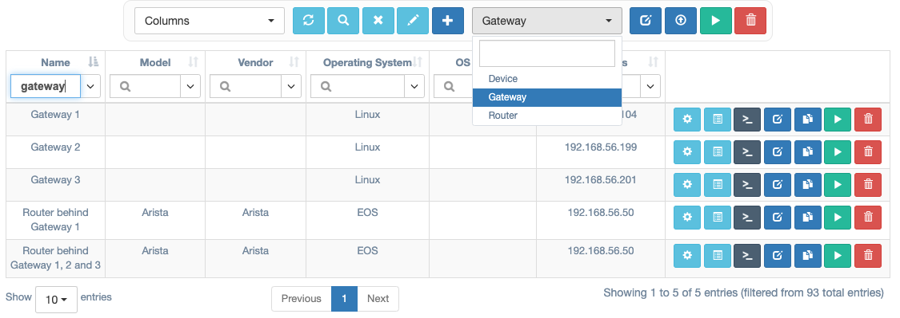
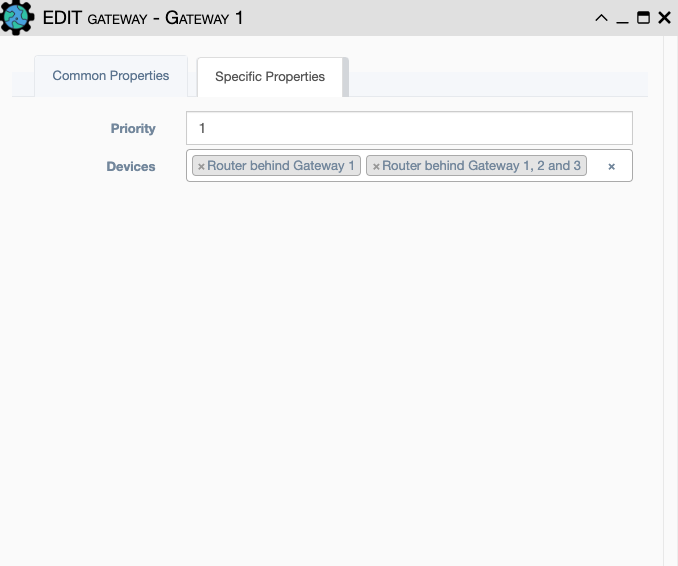
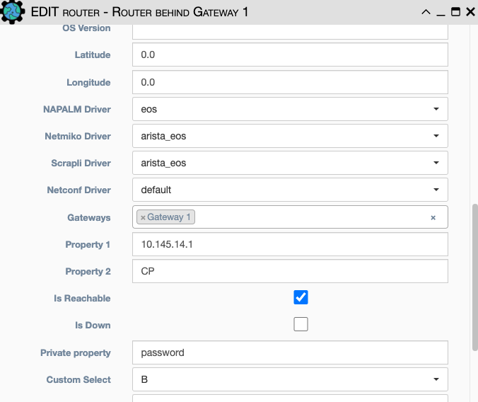

# SSH Gateways

The SSH Gateway feature allows you to specify a `Gateway` device that will be used 
before accessing the desired device. This is similar to a jumphost or jumpserver 
configuration. This feature *only* works with Netmiko services using SSH.  

## Create a Gateway

From `Inventory -> Devices`, use the device type drop down to select a device of type 
`Gateway`. The `Gateway` is created and can be used by services in the same way as other
device types. 

In the case where multiple gateways are needed, a priority mechanism may be used to 
control the order in which the gateways should be accessed. The highest priority
number wins precedence. 

## Using a Gateway

To force a device to use a `Gateway`, you may add the device to the `Gateway` as pictured
above, or you may specify the `Gateway` on the device, depending on the order of 
creation. 

