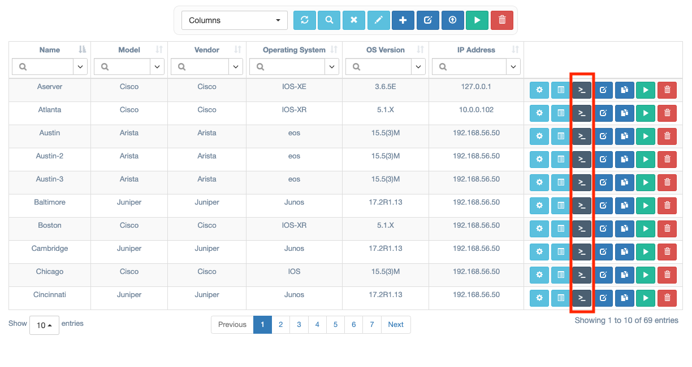
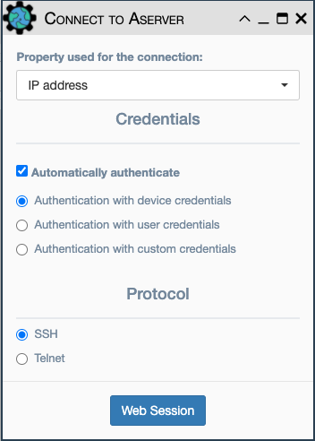

# WebSSH Connection
WebSSH provides terminal access to a device where eNMS establishes 
a Telnet or SSH session to the device using the information stored in the
network inventory.  There are multiple ways to establish a WebSSH connection.

## From Devices Inventory Table

You can connect to a device by clicking on the `Connect` button of a device
entry in the `Inventory -> Devices` table as shown below.

The following dialog will appear:

You can configure the following parameters:

- `Property used for the connection`: This dropdown list is used to select one
of the following options:
    - `IP address`: This is the IP address stored in inventory for the device.
    - `Name`: This is the name property of the selected device.
    - `Console 1`: The value stored in the Console 1 property for the device.
    - `Console 2`: The value stored in the Console 2 property for the device.
- `Automatically authenticate`: (SSH only) eNMS uses the one of the sets of 
  credentials to automatically authenticate to the network device:
    - `device credentials`: (default) credentials stored in the inventory.
    - `custom credentials`: specified in the connection dialog directly to the
      device.
- `Protocol`: `SSH` or `Telnet`.

When the session parameters are configured as desired, click the `Web Session`
button to connect to the device.

## From Network Views

Connections can also be initiated to a device from views 
`Visualization / Geographical View` or `Visualization / Network Builder`.
Right-click on any device and select `Connect`.  The same dialog detailed
above is used to complete the connection process.