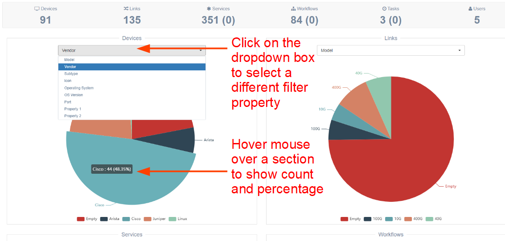
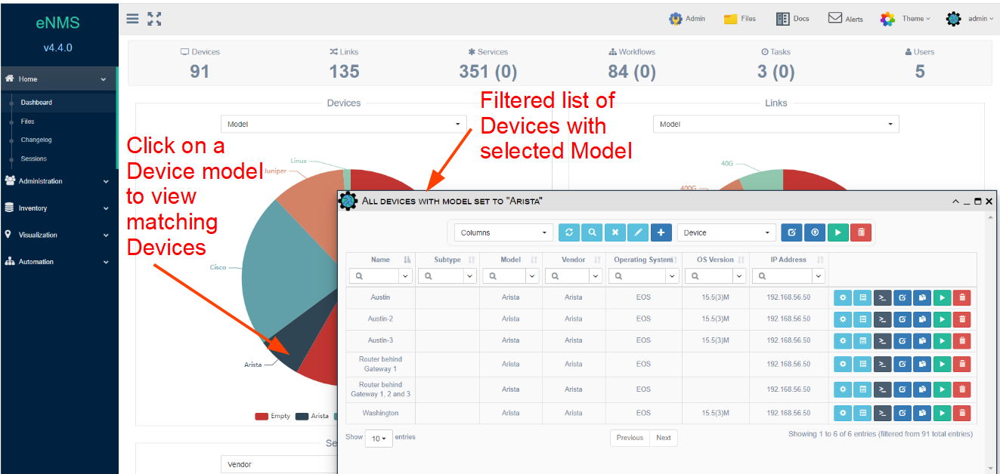

# Dashboard 

The Dashboard page contains a configurable set of graphs that display 
data about Devices, Links, Services, Workflows, Scheduled Tasks, and Users.

Each chart item provides a drop-down selection to change how these items are
grouped (and counted) in the corresponding pie chart.  Summary counts are 
displayed at the top for each category of item configured.

!!! Note

	The system calculates the dashboard statistics only once on initial load; i.e., 
	this data is not updated dynamically because repeated calculations can place a 
	burden	on the system.  To update the dashboard, reload the page in the browser
	or click on the `Dashboard` link in the navigation panel. 

The dashboard shows an additional detail at the top for each of these objects:

- `Devices`: The count of device in the inventory.
- `Links`: The count of links in the inventory.
- `Services`:  The number of created services on this instance. The number of
   running services is shown in parentheses.
- `Tasks`:  The number of created Tasks on this instance. The number of active 
   tasks is shown in parentheses.  
- `Workflows`:  The number of created workflows on this instance. The number of
   running workflows is shown in parentheses.  

[Dashboard - Devices by Model](../_static/system/dashboard.PNG)
 
## Filter 

By default, the dashboard will load with a specific filter property for each 
object type.

  

## Show Details 

The individual sections of the pie chart are also clickable, and when clicked, the 
system will open a table view showing that filter applied.

This example shows how to display the details for a specific value shown in the dashboard 
chart for Devices:

  
   
## Dashboard configuration

Please refer to this [Customization](../../advanced/customization/#dashboard-configuration) 
section for information about dashboard configuration.  
  
 
 
