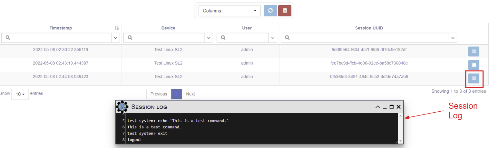

# Sessions

As a security feature, eNMS stores device interactions initiated via the 
WebSSH Connection feature into Session objects.  By default, as specified in
`setup/rbac.json`, only admin users can view the Session data.

An admin user can use `System -> Sessions` to view the Session data:

  