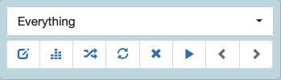
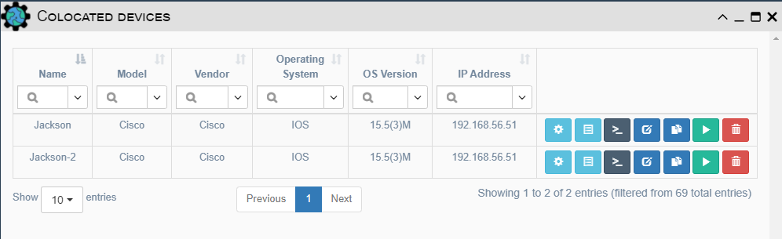

# Geographical View

All data in this visualization mode is rendered on a 2D map .

## Visualization Controls

- Dropdown list - Displays all pools containing devices and links. Selecting
one causes all devices and links defined in the selected pool to be displayed.
- Buttons (From left to right).
    - Edit Pool: Change criteria for what entities will be included in the
      defined pool.  Refer to the `Inventory / Pools` section of documentation
      for information on pool creation.
    - Device Filtering: Opens a dialog to provide criteria for selecting a
      subset of pool devices currently displayed.  Enter criteria, close the
      dialog and hit the Refresh button to update the display.
    - Link Filtering: Opens a dialog to provide criteria for selecting a subset
      of links currently displayed.  Enter criteria, close the dialog and hit
      the Refresh button to update the display.
    - Refresh: This button is used to refresh the display and is required 
      to apply any filtering changes.
    - Clear Search - Removes all filtering criteria and refreshes the map.
    - Run Service: Opens a dialog box to select and run a service on all
      devices currently displayed on the map.
    - Previous View: View previously selected pool/filtering data on the map.
    - Next View: View pool/filtering data on map that is more recent than data
      currently being displayed. This option is only available if you have
      clicked the Previous View button.

### Network Data 

Network device images are controlled by the `Icon` 
property of a device. The image type can be set by editing a device in 
`Inventory / Devices` or by clicking on a device in the display to open the 
`Edit Device` dialog and setting the `Icon` property to the desired image type. 

Links appear as lines between two devices on the map. Links have a `Color` 
property that can be set to customize the color of the line drawn for a Link.
This value can be set by editing a link in `Inventory / Links` or by clicking a
link in the display and setting the `Color` property with the desired color 
code. Color format is #RRGGBB where RR is a hex value for red level, GG is a
hex value for green level, and BB is a hex value for blue level.

### Colocated Devices

The geographical view displays all devices at their GPS coordinates. If
several devices are colocated (i.e. in the same building), they are grouped
together on the map. The 
image is used to identify when multiple devices are at the same location.
All colocated devices can be viewed by clicking on this image on the map.
A dialog will open showing all devices that are at the selected location.

### Device Markers

Marker type is selected by right-clicking the map and selecting `Type of 
Marker`. The options are:

- Image - (**Default**) The images associated with the `Icon` property of a
  device.  See the Network Data section above for how to set this property.
- Circle - A small blue dot. Recommended for large inventory.
- Circle Marker - A circle with a bold border and translucent fill centered on
  the location of the device. 

### Tile Layers

There are two types of tiles available:

- Open Street Map - The imagery used to draw the map is from the Open Street
  Map project.
- Google Maps - The imagery is from Google Maps.

To set the desired tile layer, right-click the map and select `Tile layer` and
then click the desired option.

### Clustered View

In this view devices are grouped together on the map based on their 
proximity to each other. To access the clustered view, right-click on the
map and select `Type of View > Clustered`. Zooming in or out triggers a 
recalculation of clusters. Hovering over a cluster indicator shows which 
locations are included in the cluster by drawing a polygon connecting the outer
sites of those included in the entire cluster. The image below uses the Circle
Marker to indicate device locations on the Open Street Map tile layer.

